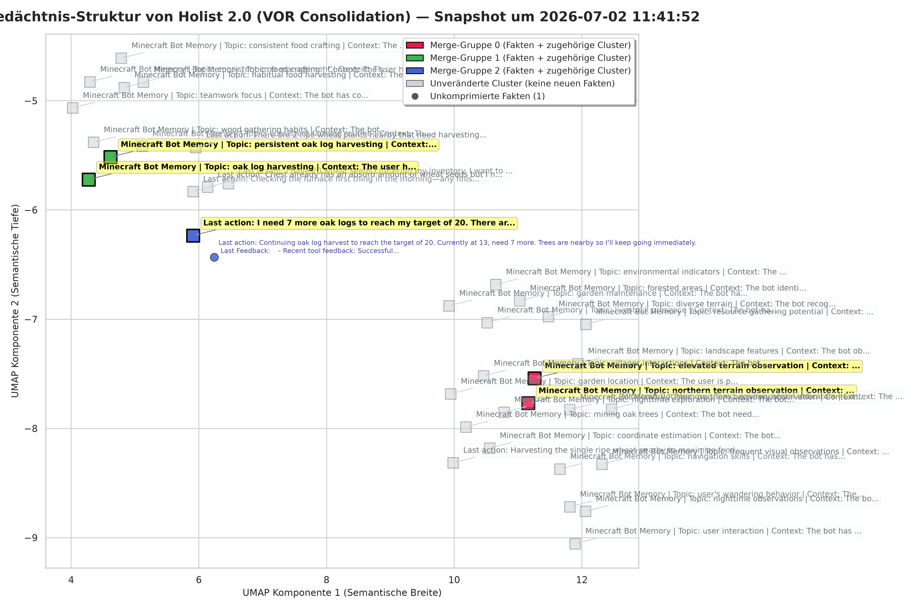
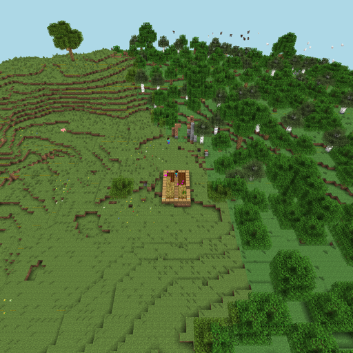

# Holist
### Mineflayer Bot with LLM and Pre-storage Reasoning for Episodic Memory

<div align="center">
  
</div>

The distinctive feature of Holist 2.0 is its memory module. 
Episodes pass through an LLM, where they undergo significant consolidation and abstraction, 
as shown below and 'keys' are generated to provide an extended context for contextual embedding. 
The episodes are then embedded using Andy-4.2-Micro, that is used as a pre-trained deep embedding model. 
This allows the bot to better distinguish between the specific purposes of the bot's tasks, 
rather than merely identifying general associations. 
HDBSCAN is employed for a scalable hierarchical clustering. 
Finally, the LLM is invoked again to generate cluster descriptions, and the process continues iteratively.


**An important change is that with each call, retrieval now delivers not just individual memory fragments, but a multi-layered representation of the world:**

1. Macro level (The world): In which village does the bot live? What are the characteristics of the neighborhood (market, residential area)?
2. Meso level (Social role): Where is its workplace (workshop)? What is its job there?
3. Micro level (habits): What are its typical morning routines? What is the current status of its tools?


**The unique aspect is the dynamic management of the RAG process. The text above is not a static prompt, and the entries are not completely different every time.**

- Marketplace example: If the bot wants to buy something, the system hides irrelevant morning routines and instead provides information about the vendors and their stalls, the rest of the text above remains the same.


**Here is an example of the entries in memory:**

📌 Cluster 1 (26 Items combined):

```text
   • [spatial generalization]   base location:              Base likely at x: 25.5, y: 71.0, z: 0.5 due to repeated pathing and vision focus
   • [spatial generalization]   nether portal structure:    Nether portal at x: 13.6, y: 66.0, z: -26.7 near obsidian path
   • [spatial generalization]   forest biome area:          Forest patch centered around x: 55.5, y: 73.0, z: 17.5 with scattered trees
   • [accumulation]             frequent base proximity:    Bot returned to ~x:30.5, z:-2.5 three times within 4.5 hours
   • [transformation]           exploration shift:          Moved from plains base to forest and nether portal zone
   • [connection/implication]   path construction:          Stone slab at x:42.6 connects base to nether portal area
   • [extension/generalization] bot identity:               Bot is a structured base-building scout with nether access
   • [specification/refinement] nether access requirements: Requires 10 obsidian, flint/steel, and secure overworld entry
```

📌 Cluster 2 (4 Items combined):

```text
    • [accumulation]                iron processing activity:   Multiple iron-related actions occurred in rapid succession
    • [specification/refinement]    tool availability:          Only wooden pickaxes available, indicating early progression stage
    • [connection/implication]      resource misinterpretation: Ate raw iron—likely confused with food, indicating inexperience
    • [transformation]              efficiency shift:           Moved from passive storage to active iron utilization
    • [spatial generalization]      base location:              Base likely at x: -128.5, y: 64, z: 75.5, where chest was inspected and iron mined nearby
```

<div align="center">
  
</div>