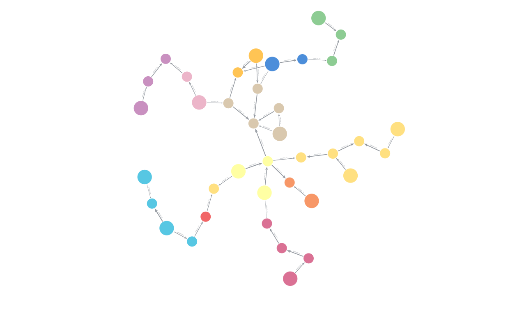

# Holist
### Mineflayer Bot with LLM and Pre-storage Reasoning for Episodic Memory

<div align="center">
  
</div>

The most important module is the memory. The reranker llama-nemotron-rerank-vl-1b-v2 is used to calculate the score between a new episode 
and the nodes in the knowledge graph and is inserted at that point. 
Using the reranker allows for the detection of contextual nuances for instance, 
recognizing not only specific fields of activity but also that a "garden bed" might relate to the topic of "food supply." 
Subsequently, the Louvain method is employed to identify clusters, which are then consolidated and abstracted by an LLM. 
These are recorded as new nodes, if the abstraction alters the context, the resulting node may be 
positioned differently within the graph than the original cluster from which it emerged.


**An important change is that with each call, retrieval now delivers not just individual memory fragments, but a multi-layered representation of the world:**

1. Macro level (The world): In which village does the bot live? What are the characteristics of the neighborhood (market, residential area)?
2. Meso level (Social role): Where is its workplace (workshop)? What is its job there?
3. Micro level (habits): What are its typical morning routines? What is the current status of its tools?


**The unique aspect is the dynamic management of the RAG process. The text above is not a static prompt, and the entries are not completely different every time.**

- Marketplace example: If the bot wants to buy something, the system hides irrelevant morning routines and instead provides information about the vendors and their stalls, the rest of the text above remains the same.


**Here is an example of the entries in memory:**

📌 Cluster 1 | Here the bot planed a mining expedition:

```text
Macro:  The bot has consistently harvested wheat from the nearby field and sought out iron ore, 
        indicating a habitual pattern of resource management focused on food production and tool enhancement. 
        The bot is currently near its base at coordinates x: 25.5, y: 72, z: 0.5, 
        and has identified a rich resource area with four nearby iron ore blocks, 
        as well as a wheat field at approximately x: 10, y: 64, z: 15, suggesting a strategic location for gathering essential resources.
Meso:   The bot's immediate goal is to harvest the 4 ripe wheat blocks at its base to ensure it has enough food 
        before embarking on a mining expedition at sunrise.
Micro:  The bot has identified that it can use its stone pickaxe to mine coal ore, 
        which is essential for smelting raw iron into iron ingots,
```

📌 Cluster 2 | Here, the bot works in the field and sees that other bots are online.:

```text
Macro:  The bot developed a strong focus on food production and farming activities over time. 
        The bot's current inventory includes 64x wheat, 64x wheat_seeds, and 59x bread, 
        which are essential for sustaining its food supply and suggest a need to prioritize 
        planting and harvesting in the nearby wheat field to ensure a steady food supply.
Meso:   Accumulated over 2 stacks of 64 wheat seeds in the chest. 
Meso:   The bot has recognized the importance of teamwork in resource management and has proposed a division of labor, 
        indicating a broader trend towards collaborative strategies in gameplay. 
Micro:  The bot's immediate goal is to harvest the last ripe wheat block in the field 
        before proceeding to locate coal veins
Micro:  The bot's intention to reach out to teammates Caleb and Kelly.
```

<div align="center">
  
</div>